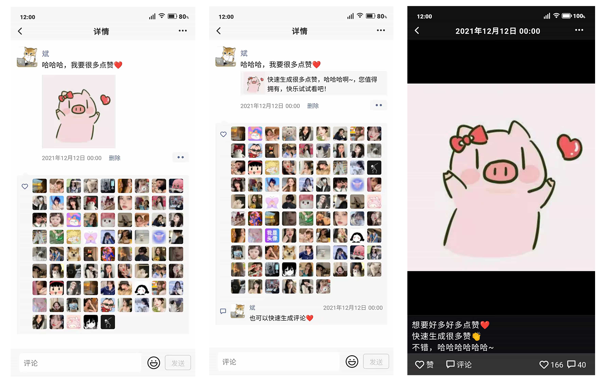

# 仿朋友圈集赞页面生成

[去这里使用](https://pyq.jzzz66.cn/about.html)

此工具是一个前端菜鸟初学者为了更好的学习前端，练习项目时所写的。  
开源让大家相互学习，指点一下代码可优化的地方。  
使用 [uniapp](https://uniapp.dcloud.io/) 写的，目前只兼容了 h5，后续有空再兼容微信小程序。  
可以通过填写发表者信息或者根据截图生成仿微信朋友圈的集赞页面。  
总共可以生成 3 种样式。

- 图文样式
- 链接样式
- 主图样式



## 如何运行

- 克隆项目到本地

```
git clone https://github.com/zxb1655/weipyq
```

- 安装依赖

```
yarn
```

- 运行项目

```
yarn dev:h5
```

- 打包项目

```
yarn build:h5
```

## 开源特别声明

- 本仓库发布的`weipyq`项目中涉及的任何内容，仅用于测试和学习研究，禁止用于商业用途，不能保证其合法性，准确性，完整性和有效性，请根据情况自行判断。

- 本项目内所有资源文件，禁止任何公众号、自媒体进行任何形式的转载、发布。

- `weipyq` 对任何商业问题概不负责，包括但不限于由任何人使用本项目导致的任何损失或损害.

- 请勿将`weipyq`项目的任何内容用于商业或非法目的，否则后果自负。

- 如果任何单位或个人认为该项目的脚本可能涉嫌侵犯其权利，则应及时通知并提供身份证明，所有权证明，我们将在收到认证文件后删除相关内容。

- 以任何方式查看此项目的人或直接或间接使用`weipyq`项目的使用者都应仔细阅读此声明。`zxb1655` 保留随时更改或补充此免责声明的权利。一旦使用并复制了任何相关代码或`weipyq`项目，则视为您已接受此免责声明。

> **_您使用或者复制了本仓库且本人制作的任何代码或项目，则视为`已接受`此声明，请仔细阅读_**

### 怎么获取微信文章详情？

- 目前使用的获取公众号文章的封面图和标题的 API 是我自己用 node 写的小程序，仅仅只是获取封面和标题。已经设置允许跨域，可以直接调用这个接口获取信息。

### 生成头像是从哪来的？

- 头像都是我自己手动从 [我要个性网](https://www.woyaogexing.com/) 转存的。如果你在此工具中发现了你正在使用的头像则纯属巧合。
